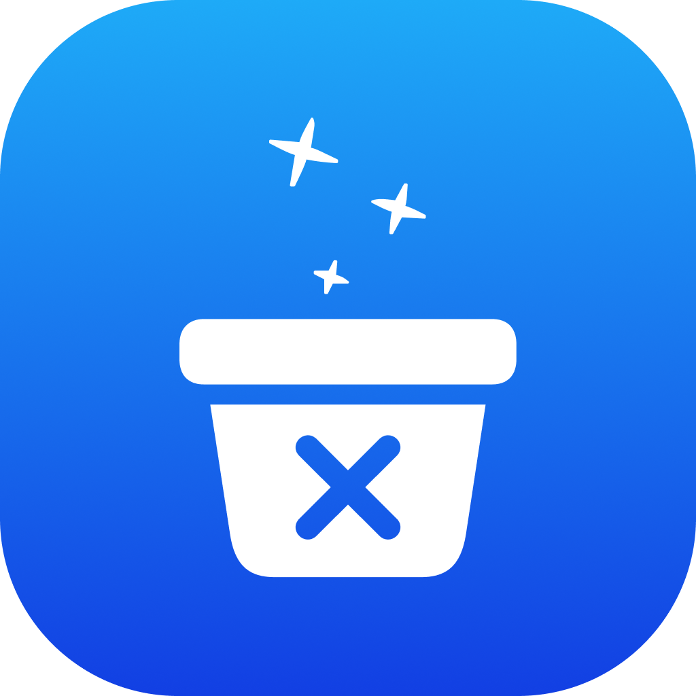

<p align="center">
  
</p>

<h1 align="center">Ditch</h1>
<p align="center"><strong>Drag. Drop. Ditch.</strong></p>
<p align="center">A lightweight macOS app cleaner that lives in your MacBook's notch.</p>

<p align="center">
  <a href="https://github.com/prabinbhusal/ditch/releases/download/v1.0.0/Ditch-1.0.0.dmg"></a>
  <a href="https://github.com/prabinbhusal/ditch/stargazers"></a>
  
  
  
</p>

<p align="center">
  
</p>

---

## What is Ditch?

Ditch is a free, open-source macOS utility that turns your MacBook's notch into an app cleaner. Drag any app to the notch and it cleanly removes it along with every hidden cache, preference file, container, and leftover.

No clutter. No bloat. Just drag, drop, and ditch.

## Features

- **Notch-native**: lives in your MacBook's notch. Appears when you drag an app, hides when you're done.
- **Deep cleaning**: finds and removes leftover caches, preferences, containers, logs, and cookies.
- **File preview**: see exactly what gets removed before you confirm. Click any file to reveal it in Finder.
- **Launch at Login**: runs automatically in the background.
- **Haptic feedback**: satisfying vibrations on drag, drop, and clean.
- **Safe removal**: everything goes to Trash, so you can restore if needed.
- **Ultra lightweight**: pure Swift, no Electron, under 1MB.

## How It Works

1. **Drag** any `.app` from `/Applications` toward the notch
2. **Drop** it into the drop zone
3. **Review** the related files found
4. **Ditch**: click Remove to clean it all up

## Requirements

- macOS 13.0 (Ventura) or later
- MacBook with notch (works in fallback mode on non-notch Macs)

## Installation

[**Download Ditch-1.0.0.dmg**](https://github.com/prabinbhusal/ditch/releases/download/v1.0.0/Ditch-1.0.0.dmg)

Open the DMG and drag Ditch to your Applications folder.

## Build from Source

```bash
git clone https://github.com/prabinbhusal/ditch.git
cd ditch
xcodebuild -project Ditch.xcodeproj -scheme Ditch -configuration Release build
```

Or open `Ditch.xcodeproj` in Xcode and hit `⌘R`.

## What Gets Cleaned

When you drop an app, Ditch scans for related files across:

| Location                             | Category         |
| ------------------------------------ | ---------------- |
| `~/Library/Application Support/`     | App Support      |
| `~/Library/Caches/`                  | Caches           |
| `~/Library/Preferences/`             | Preferences      |
| `~/Library/Logs/`                    | Logs             |
| `~/Library/Saved Application State/` | Saved State      |
| `~/Library/Containers/`              | Containers       |
| `~/Library/Group Containers/`        | Group Containers |
| `~/Library/Cookies/`                 | Cookies          |
| `~/Library/HTTPStorages/`            | HTTP Storage     |
| `~/Library/WebKit/`                  | WebKit Data      |
| `~/Library/Application Scripts/`     | App Scripts      |
| `~/Library/Logs/DiagnosticReports/`  | Crash Reports    |

## Contributing

Contributions are welcome! See [CONTRIBUTING.md](CONTRIBUTING.md) for guidelines.

## License

MIT: see [LICENSE](LICENSE).
